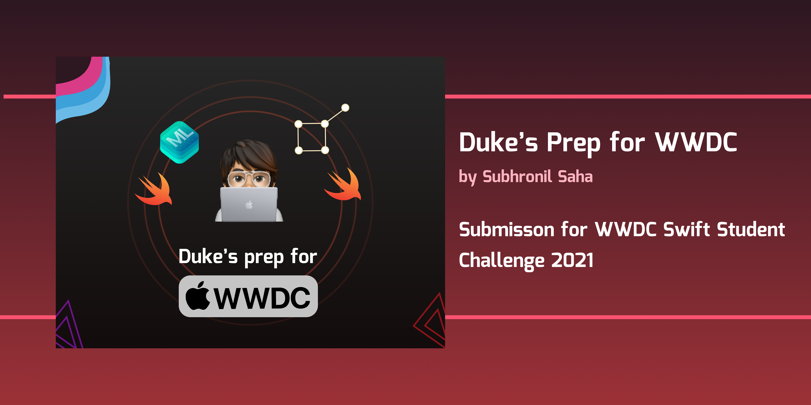
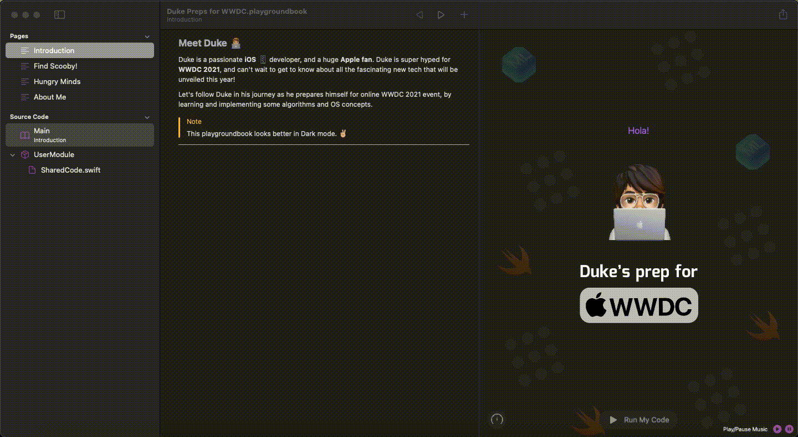
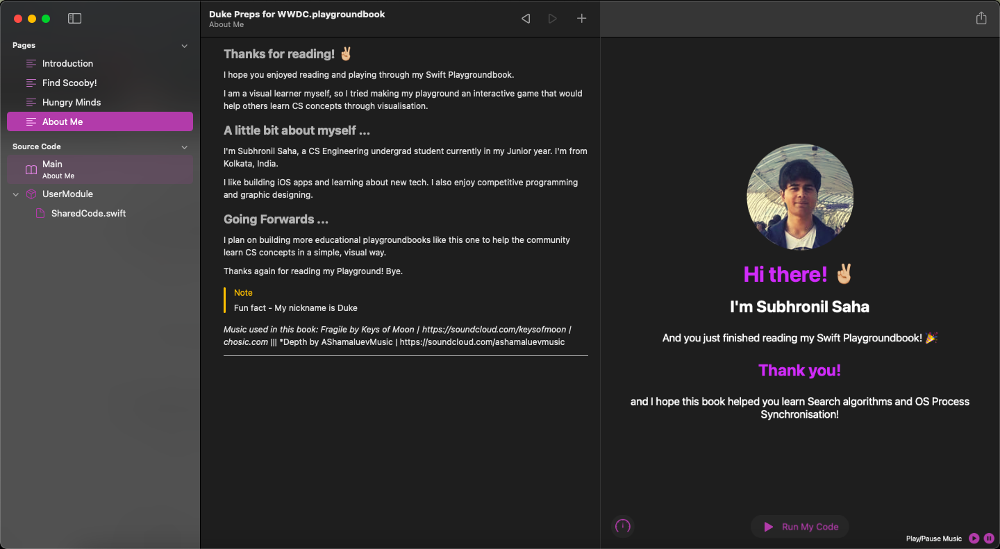

# Duke's Prep for WWDC :technologist:	

My Swift Playground Submission for WWDC 2021 Swift Student Challenge!

**In this Swift Playground, follow Duke the iOS developer's journey as he prepares himself for WWDC 2021 online event, and learns and implements various CS concepts along the way.**

**This Playgroundbook aims to make algorithmic concepts of graph search and OS concepts of Process Synchronisation visual and easy to understand.**

## Introduction

1. Page 2 of this playground book shows graph search visualisations of the following algorithms : Depth First Search (DFS), Breadth First Search (BFS), Dijkstra algorithm and A Star Algorithm. Also shows how many cells each visits to understand the time comparison of each.
2. Page 3 explains the Dining Philosophers problem related to Process Synchronisation in Operating Systems in a fun and intuitive game. It also teaches players the concept of deadlock and how to overcome it.

## Technologies used to build this project 

`SwiftUI`, `AVKit`

## Installation :computer:	

Download the project and run the `Duke Preps for WWDC.playgroundbook` file on Swift Playgrounds on Mac or iPad (Mac recommended). Alternatively, build the XCode project located in `PlaygroundBookTemplate -> Template -> PlaygroundBook.xcodeproj`

## Screenshots and Demos:

